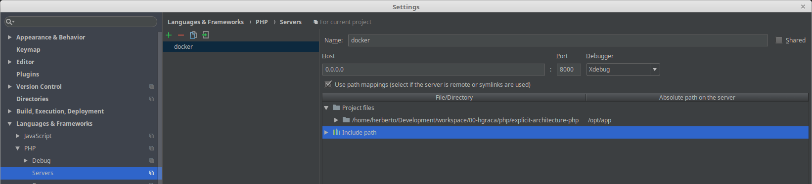
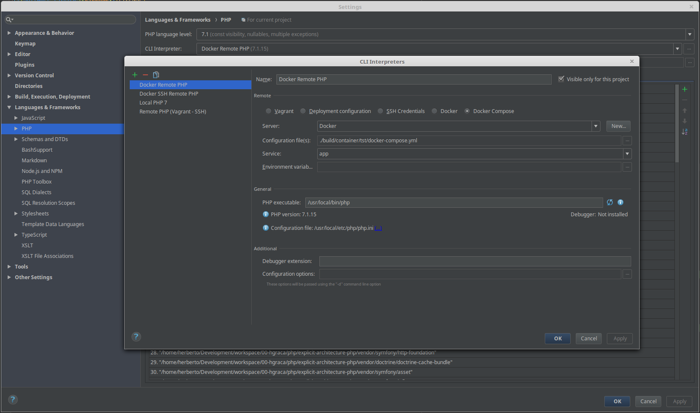
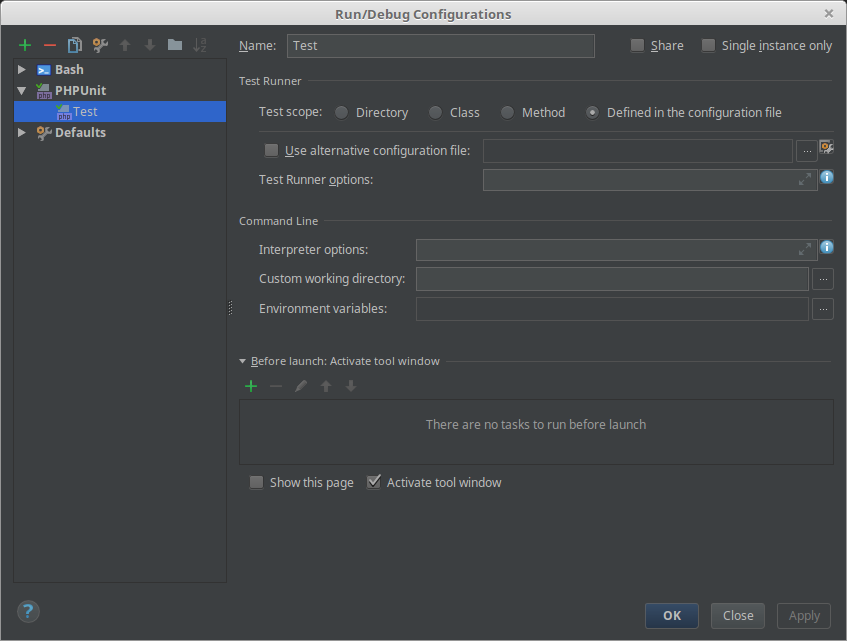

# Explicit Architecture 

[![Author][Author]](https://www.herbertograca.com)
[![Software License][License]](LICENSE)

[![Build Status][Build]](https://scrutinizer-ci.com/g/hgraca/explicit-architecture-php/build-status/master)
[![Scrutinizer Code Quality][Score]](https://scrutinizer-ci.com/g/hgraca/explicit-architecture-php/?branch=master)
[![CodeCov][CodeCov]](https://codecov.io/gh/hgraca/explicit-architecture-php)

[![Code Intelligence Status][CodeInt]](https://scrutinizer-ci.com/code-intelligence)

## Symfony Demo Application

The "Symfony Demo Application" is a reference application created to show how
to develop Symfony applications following the recommended best practices.

This repository is a demo of [Explicit Architecture][1], using the [Symfony Demo Application][2].

There is code in this project that not used and therefore it would be removed in a real project, nevertheless 
it was included here as examples.

### Explicit Architecture

I explained [Explicit Architecture][1] in one of my blog posts, as a result of my understanding of several architectural
 styles such as (but not limited to) [EBI Architecture][11], [DDD][12], [Ports & Adapters Architecture][13], 
 [Onion Architecture][14] and [Clean Architecture][15].
 
[][2]

#### Package by component

[][17]

#### Dependencies directions

[][16]

#### Folder structure

- **bin** (_application binaries, however the dependencies binaries should go in vendor/bin_)
- **build** (_artifacts needed for building the application prior to running it_)
- **config** (_all the config needed to run the application_)
- **docs** (_application documentation_)
- **lib** (_libraries used by the application, which are specific to this application and/or not distributable_)
    - **php-extension**  (_functions and/or classes to be used as if they were part of the language itself_)
        - _src_
        - _tests_
- **public** (_the entry point to the application, and public frontend artifacts like CSS and JS files_)
- **src**
    - **[Core][10]** (_the application core_)
        - **[Component][5]** (_the application components/bounded contexts_)
        - **[Port][8]** (_the ports, to be implemented by the infrastructure adapters_)
        - **[SharedKernel][6]** (_application and domain code shared among all components/bounded contexts_)
    - **[Infrastructure][9]** (_the port adapters for the infrastructure tools_)
    - **[Presentation][7]** (_the presentation layer with the several user facing applications, controllers, views and related code units_)
- **tests**
    - **Fixture** (_data to put in the DB and use in the tests_)
    - **Framework** (_support code to run the tests, like base test classes and assertions_)
    - **TestCase** (_unit, integration, functional, acceptance tests_)
- **translations**
- **var** (_volatile artifacts like logs, cache, temporary test databases, generated code, ..._)
- **vendor** (_distributable libraries_)

## Usage

You need to have docker installed in your host OS. 

Then execute this command to run the app in dev mode: 

```bash
$ make up
```

or this command to run the app in production mode: 

```bash
$ make up-prd
```

Access the application in your browser at <http://localhost:8000>.

You can also test the error pages at `http://localhost:8000/index.php/_error/{statusCode}.{format}`,
 ie. <http://localhost:8000/index.php/_error/400.html>.

To see all commands available run:

```bash
$ make
```

### Tests

Execute this command to run tests:

```bash
$ make test
```

Or this command to run tests and get the coverage:

```bash
$ make test_cov
```

### Integration with PHPStorm

Integration with PHPStorm is straight forward.

Configure the servers so we can debug a request made from the browser:


Configure the CLI so we can run the tests:


Configure the test run itself:


### Debug

The dev container has xDebug installed and you can use it out of the box, provided that you have your IDE configured
 appropriately.
 
Check the screenshots in the `docs/IDE/PHP_Storm/` folder, to check how to configure PHP Storm to work with xDebug, as
 it is set up in the dev docker image.
 
To run the tests with xDebug enabled, you need to enable it in `container/tst/xdebug.ini:1` prior to running the tests.

[1]: https://herbertograca.com/2017/11/16/explicit-architecture-01-ddd-hexagonal-onion-clean-cqrs-how-i-put-it-all-together/
[2]: https://docs.google.com/drawings/d/1E_hx5B4czRVFVhGJbrbPDlb_JFxJC8fYB86OMzZuAhg/edit?usp=sharing
[5]: http://ddd.fed.wiki.org/view/welcome-visitors/view/domain-driven-design/view/bounded-context
[6]: http://ddd.fed.wiki.org/view/welcome-visitors/view/domain-driven-design/view/shared-kernel
[7]: https://herbertograca.com/2017/11/16/explicit-architecture-01-ddd-hexagonal-onion-clean-cqrs-how-i-put-it-all-together/#primary-or-driving-adapters
[8]: https://herbertograca.com/2017/11/16/explicit-architecture-01-ddd-hexagonal-onion-clean-cqrs-how-i-put-it-all-together/#ports
[9]: https://herbertograca.com/2017/11/16/explicit-architecture-01-ddd-hexagonal-onion-clean-cqrs-how-i-put-it-all-together/#secondary-or-driving-adapters
[10]: https://herbertograca.com/2017/11/16/explicit-architecture-01-ddd-hexagonal-onion-clean-cqrs-how-i-put-it-all-together/#application-core-organisation
[11]: https://herbertograca.com/2017/08/24/ebi-architecture/
[12]: https://herbertograca.com/2017/09/07/domain-driven-design/
[13]: https://herbertograca.com/2017/09/14/ports-adapters-architecture/
[14]: https://herbertograca.com/2017/09/21/onion-architecture/
[15]: https://herbertograca.com/2017/09/28/clean-architecture-standing-on-the-shoulders-of-giants/
[16]: https://docs.google.com/drawings/d/1DGiP9qyBpRHPDPKRJoXdElw1DXwmJoR-88Qvtf6hBNA/edit?usp=sharing
[17]: https://docs.google.com/drawings/d/1QurViCcaZ4Eh1CgBvel9aK5RLBkw2TaOAnO-Lhu4pfw/edit?usp=sharing

[Author]: http://img.shields.io/badge/author-@hgraca-blue.svg?style=flat-square
[License]: https://img.shields.io/badge/license-MIT-blue.svg?style=flat-square

[Build]: https://scrutinizer-ci.com/g/hgraca/explicit-architecture-php/badges/build.png?b=master
[Score]: https://scrutinizer-ci.com/g/hgraca/explicit-architecture-php/badges/quality-score.png?b=master
[CodeCov]: https://codecov.io/gh/hgraca/explicit-architecture-php/branch/master/graph/badge.svg
[CodeInt]: https://scrutinizer-ci.com/g/hgraca/explicit-architecture-php/badges/code-intelligence.svg?b=master
